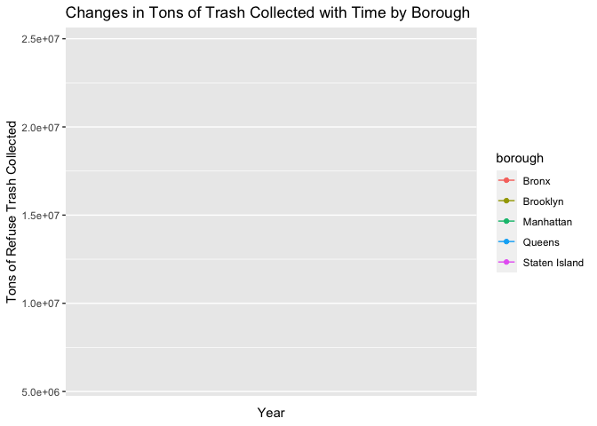
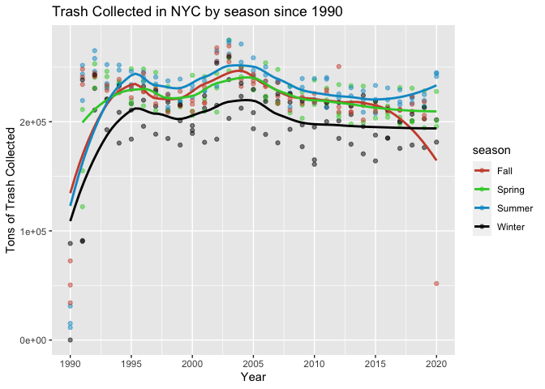

<!-- README.md is generated from README.Rmd. Please edit that file -->

# NYCTrash

<!-- badges: start -->


<!-- badges: end -->

The goal of NYCTrash is to understand changes in monthly trash patterns
in NYC by borough.

## Installation

You can install the released version of NYCTrash from
[CRAN](https://CRAN.R-project.org) with:

``` r
install.packages("NYCTrash")
```

And the development version from [GitHub](https://github.com/) with:

``` r
# install.packages("devtools")
devtools::install_github("aparikh21/NYCTrash")
```

## Example

``` r
NYCTrash
#> # A tibble: 21,048 x 12
#>    year  month borough community_distr… refuse_tons_col… paper_tons_coll…
#>    <chr> <chr> <chr>   <chr>                       <dbl>            <dbl>
#>  1 1993  " 11" Manhat… 01                           625.            119. 
#>  2 1992  " 03" Manhat… 01                           726              NA  
#>  3 1995  " 08" Manhat… 01                           628.             82.4
#>  4 1991  " 08" Manhat… 01                           695.             NA  
#>  5 1995  " 09" Manhat… 01                           633.            117. 
#>  6 1996  " 04" Brookl… 07                          3479.            279. 
#>  7 2007  " 08" Brookl… 07                          3648.            515. 
#>  8 2012  " 01" Brookl… 07                          3157.            437. 
#>  9 2003  " 11" Brookl… 07                          3730.             NA  
#> 10 2004  " 08" Brookl… 07                          3696.            497. 
#> # … with 21,038 more rows, and 6 more variables: mpg_tons_collected <dbl>,
#> #   organic_tons_collected <dbl>, school_organics <dbl>, leaves_organics <dbl>,
#> #   xmas_tress <dbl>, borough_id <dbl>
time <- NYCTrash %>%
  group_by(year, borough) %>%
  summarize(refuse_tons_collected = sum(refuse_tons_collected))

ggplot(
  time,
  aes(x = as.numeric(year), y = refuse_tons_collected, color = borough)
) +
  geom_point() +
  geom_line() +
  scale_x_continuous(breaks = seq(1990, 2020, 5)) +
  labs(x = "Year", y = "Tons of Refuse Trash Collected") +
  ggtitle("Changes in Tons of Trash Collected with Time by Borough")
```



Tons of trash collected in NYC have not significantly increased or
decreased since the 1990s. 2020 seems to be an unusual year where the
tons of trash collected has significantly decreased which could be due
to less consumption caused by the pandemic.

Brooklyn is the borough with the most refuse tons of trash collected
every year after 1991 while Queens is the borough with the second most
tons of refuse trash collected. It is interesting to note that the trash
collected in Queens, Brooklyn and Manhattan increase dramatically
between 1990 and 1991. It could be worth examining the reason behind
this dramatic increase in trash collected.

The trends during the last 20 years have been similar for all boroughs.
All boroughs saw a spike in trash collected in 2003 and all saw declines
in trash collected in 2020. The fact that trends have stayed the same
between all boroughs could reveal the fact that no borough is
significantly improving or becoming worse, hence keeping the ratio of
the population in the boroughs roughly
similar.

### b) Is there an association between time of year and the amount of refuse trash collected?

SOLUTION:

``` r
seasonal_trash <- NYCTrash %>%
  group_by(month, year) %>%
  summarize(refuse = sum(refuse_tons_collected)) %>%
  mutate(month = as.numeric(month)) %>%
  mutate(season = ifelse(month %in% 3:5, "Spring",
                                     ifelse(month %in% 6:8, "Summer", 
                                            ifelse(month %in% 9:11, "Fall", "Winter"))))


ggplot(seasonal_trash,
  aes(x = as.numeric(year), y = refuse, color = season)) +
  geom_point(alpha = 0.5) +
  geom_smooth(method = "loess", se = FALSE, span = 0.5) + 
  scale_x_continuous(breaks=seq(1990, 2020, 5)) +
  scale_color_manual(breaks = c("Fall", "Spring", "Summer", "Winter"),
                        values=c("tomato3", "limegreen", "deepskyblue3", "black")) +
  labs(x = "Year", y = "Tons of Trash Collected") + 
  ggtitle("Trash Collected in NYC by season since 1990")
```

 The
winter months of December, January and February have consistently had
the lowest amount of trash collected. A possible reason for this could
be that people do not go out and consume less during the colder months.
On the other hand, the summer months of June, July and August have had
the most trash collected suggesting that people consume the most during
the warmest months.

The fall months and spring months have more or less followed similar
trends (the decline in the fall line after 2015 is misleading because
the line is severely influenced by 2020 fall trash collection.) It would
be interesting to investigate the reason behind this drop in tons of
trash collected in the fall months of 2020, but it would presumably be
because of the pandemic.

Yearly changes in trash collection seems to affect seasonal consumption
evenly because the four lines seem to follow the same trends\!
